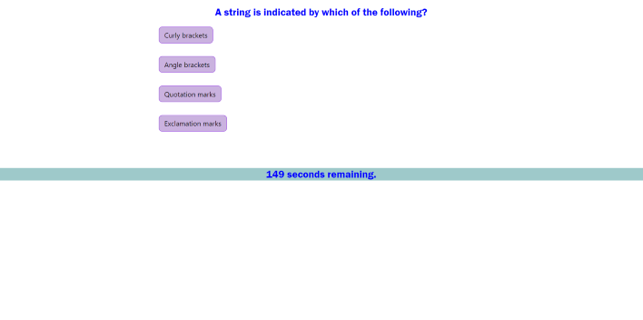

This webpage presents a 15-question Coding Quiz and provides the user with 150 seconds to complete the questions. An incorrect response will deduct 5 seconds from the timer. When the questions are completed or the timer runs out, the user may store their initials in local storage.

Deployed Application: https://kayvonk.github.io/CodeQuiz5000/
